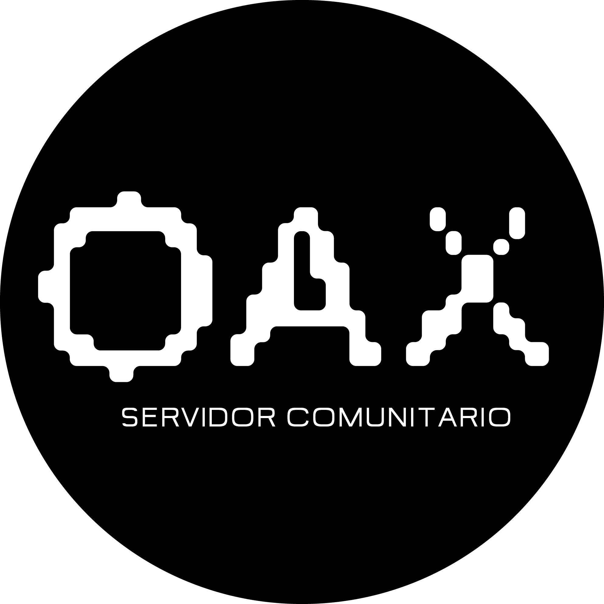

# ¿Qué es OAX?

## Para todOs, todAs y todXs

Se forma como un proyecto conjunto y horizontal que promueve la colectivización de la información. Mucha de esta información
fue generada durante la toma de instalaciones de la ENES unidad Morelia, esta toma y el paro de actividades se derivó de una 
lucha por la dignificación docente por parte de la Asamblea General de Docentes de Asignatura (AGDA) de la ENES unidad Morelia 
que fue apoyada por la Asamblea Estudiantil (AsEEM). Ante esta problemática, surgió la necesidad de contar con un espacio 
de acceso remoto para comunicar la información que surgia dentro de las instalaciones y que todos, todas y todxs 
puedan acceder de manera efectiva. De ahí nace esta página web que estás viendo en estos momentos. 

OAX está montado sobre una raspberry pi, una mini computadora que mide aproximadamente unos 10 cm x 5cm. 
Un servidor, de manera muy básica, es una computadora que está prendida 24/7/365 y que se accesa de manera remota, en este espacio
alojamos la página web de OAX. Obviamente, OAX nos se encuentra en Alaska.
Trabajamos unicamente con programas de código abierto gratuitos así que este proyecto solamente permitirá contenidos bajo
licencia de creative commons pues abogamos por que la información se mantega libre, sin intermediarios y 
evitando medidas que reduzcan, limiten o restrinjan los procesos de creación de cualquier tipo. Si te interesa subir tus proyectos, 
creaciones, etc. te invitamos a compartilos y colectivizarlos.
¡Por un mundo libre, un internet libre!

Seguimos construyendo una mejor plataforma que pueda ser host de:
- proyectos
- investigaciones 
- radio
- broadcasting
- blockchain para votaciones
- y mucho más...

Es un proyecto en crecimiento y contrucción constante, así que si tienes sugerencias ¡quien propone, se pone!
Trabajemos juntos, juntas y juntxs para generar una plataforma colaborativa.

Att. Doppel, Ambys y Gneiss
